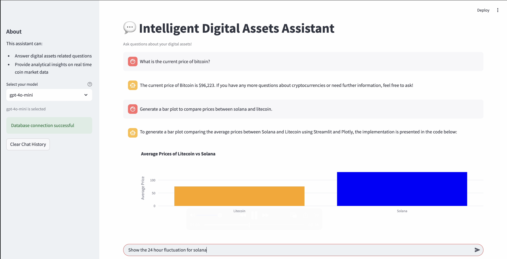
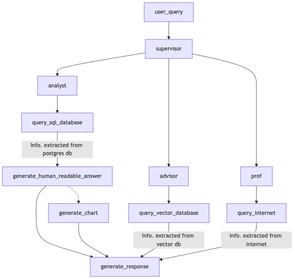

<h1>
<center>
Intelligent Digital Assets Assistant (IDAA)
</center>
</h1>

[](https://www.youtube.com/watch?v=anrQrBgF3Xw&ab_channel=AdityaNikhil)

## Table of contents
1. [Overview](#overview)
2. [Approach](#approach)
3. [Setup](#setup)
4. [Getting Started](#getting-started)
5. [License](#license)
6. [Contributors](#contributors)

## Overview
IDAA (Intelligent Digital Asset Advisor) aims to develop an AI-powered financial advisory system that integrates three essential capabilities: educational (Professor), analytical (Analyst), and advisory (Advisor) functions. The system is built using cutting-edge AI technologies including GPT-4, LLAMA 3.3, and RAG, focusing on providing comprehensive digital asset guidance. The Professor component will draw from a knowledge base of digital asset materials and concepts, while the Analyst component will process market and on-chain data for informed decision-making. The Advisor component will apply financial advising logic to guide users through their decisions, requesting additional information when needed. The project deliverables include developing AI models with robust data collection methods, proper data preparation, model training, validation, and performance tuning. All three components must work in harmony, orchestrated to engage the right capabilities at appropriate times during user interactions. This system will serve as a proof of concept for scaling digital asset advising through AI, positioned in an early-adoption industry with high growth potential.

## Approach



1. The user query is passed down to the supervisor node which is responsible for selecting the right agent to answer the given query. 
2. The `analyst` agent is connected to the postgres db which contains real time historical market data of different cryptocurrencies.
3. The `advisor` agent is connected to the pinecone vector db that contains information on trading/coin surveys necessary to advise the user.
4. The `prof` agent provides real time up to date educational content from the internet to educate the user on any digital asset related topic.
4. Given the query, if passed down to the `analyst` agent,
    1. It first checks if the query can be answered by the internal database.
    2. Then, it queries the database to extract the necessary information.
    3. Now given the question and the output from the database, it then generates a human readable answer.
    4. If the question requires any types of visualizations, its passed down to the `generate_chart` node.
5. In case the query is passed down to the `adivsor` agent,
    1. It first checks if the query is relevant and can be answered by the internal database.
    2. Then, it performs RAG operations to extract relevant information to answer the user query. 
6. Finally, the `prof` agent is responsible for educating the user based on any information to learning more about digital assets from the internet. 


## Setup

### Pre-requisites
1. Ask the owner of the repo for the database uri. (Reach out [here](linkedin.com/in/aditya-nikhil))
2. Gather API keys from langsmith, groq, openai (optional)
3. Install docker

## Getting started
Pull this project into your workspace
```python
git pull https://github.com/adityanikhil/idaa
```
Now inside the project's workspace, the following API's needs to be setup in place before getting started.

### Create `setup.yml` file
```shell
environment:
  LANGSMITH_TRACING_V2: "true"
  LANGCHAIN_ENDPOINT: "https://api.smith.langchain.com"
  LANGSMITH_ENDPOINT: "https://api.smith.langchain.com"
  LANGSMITH_API_KEY: "YOUR_API_KEY"
  LANGSMITH_PROJECT: "PROJECT-NAME"
  TAVILY_API_KEY: "YOUR_API_KEY"
  GROQ_API_KEY: "YOUR_API_KEY"
  OPENAI_API_KEY: "YOUR_API_KEY" 
  DATABASE_URI: "DATABASE_URI"
```

### Docker building

Now that the APIs have been setup. Simply run, 

```python
docker compose up --build
```

You will find your streamlit app running at: 
```python
localhost:8501
```

And also you can find the agent's fast API endpoints at:
```python 
localhost:8000/docs
```

## License
This repository is licensed under the MIT License. For more details, please refer to the LICENSE file.

## Contributors


---