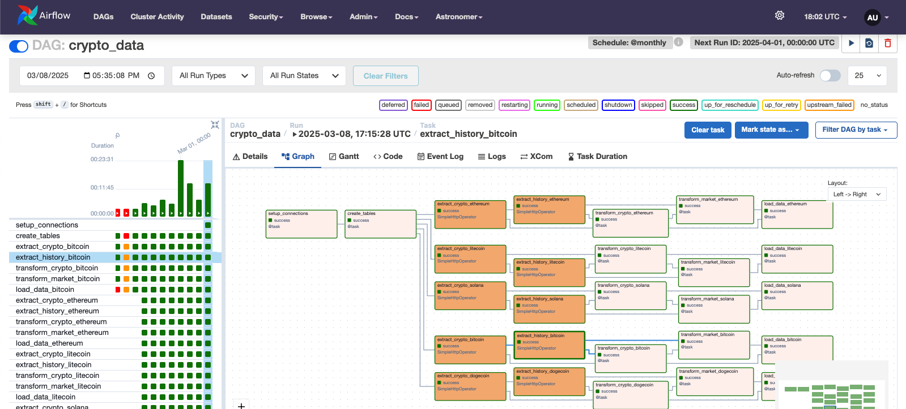
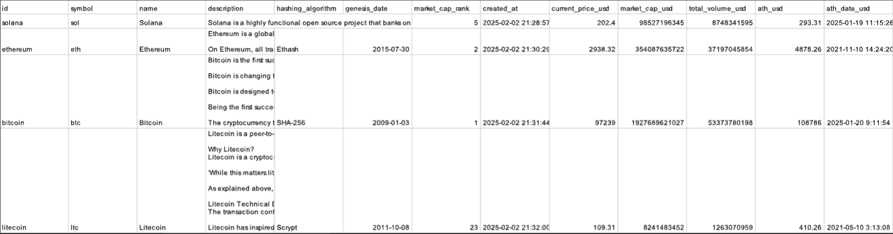
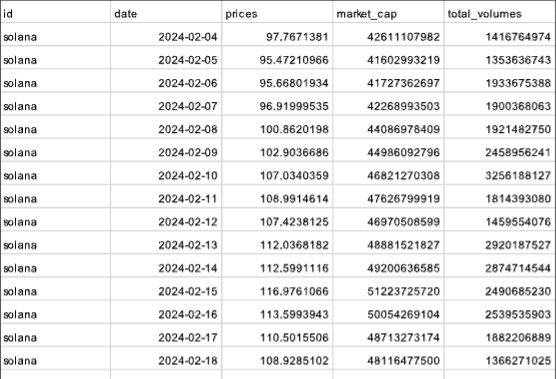

<h1>
<center>
Airflow ETL Pipeline for Crypto Data
</center>
</h1>

<p align="center">
    
</p>

## Table of contents
1. [Overview](#overview)
2. [Prerequisites](#prerequisites)
3. [Setup Instructions](#setup-instructions)
4. [Data Snapshots](#data-snapshots)

## Overview

This guide walks you through setting up an end-to-end ETL pipeline using Apache Airflow to extract cryptocurrency data from the CoinGecko API. The pipeline retrieves two types of data:

1. **Cryptocurrencies Data**: General information about different cryptocurrencies, including attributes like `id`, `symbol`, `market_cap_rank`, `price_change_24h_in_currency`.
    * Example API call: `https://api.coingecko.com/api/v3/coins/bitcoin`
2. **Market Data**: Historical market data for cryptocurrencies over the past year. This dataset includes `prices`, `market_caps` and `total_volumes`.
    * Example API call: `https://api.coingecko.com/api/v3/coins/ethereum/market_chart/range?vs_currency=usd&from=<past_timestamp>&to=<current_timestamp>`
    * You can run the following python code to get `current_timestamp` and `past_timestamp` 
        ```python
        from datetime import datetime, timedelta

        # Get current timestamp
        current_date = datetime.now()
        current_timestamp = int(current_date.timestamp())

        # Get timestamp for 365 days ago
        past_date = current_date - timedelta(days=365)
        past_timestamp = int(past_date.timestamp())

        print(f"From (365 days ago): {past_timestamp}")
        print(f"To (current): {current_timestamp}")
        ```

## Prerequisites
- [Docker](https://www.docker.com/products/docker-desktop/)
- [Astronomer CLI](https://www.astronomer.io/docs/astro/cli/install-cli)

## Setup Instructions

> [!NOTE]
> Before diving into the setup: you might want to set what crypto coins you want to extract by mentioning them [here](dags/etl.py#L251).
> Also, if mentioning more than 5 coins, consider increasing the number of [retries](dags/etl.py#L112) as well.

1. Clone this repo and navigate to the etl directory.
    ```shell
    git clone https://github.com/adityanikhil/IDAA && cd etl
    ```
2. Initialize an Astronomer project inside the `etl` directory:
    ```shell
    astro dev init
    ```
3. Start the Astro environment:
    ```shell
    astro dev start
    ```
4. Run the `crypto_data` dag from Airflow UI.
5. It'll take approximately 5-10 mins to run based on the number of [crypto coins](dags/etl.py#L251) you have mentioned. 
6. Once completed, the extracted data will be stored in a PostgreSQL database running on port 5432.
7. **Optional**: To use a custom Cloud RDB endpoint, update the connection settings [here](dags/etl.py#L18).  

## Data Snapshots

<p align="center">
    
</p>
<p align="center">
<em>General Cryptocoins Data</em>
</p>

<p align="center">
    
</p>
<p align="center">
<em>Historic Cryptocoins Data</em>
</p>

